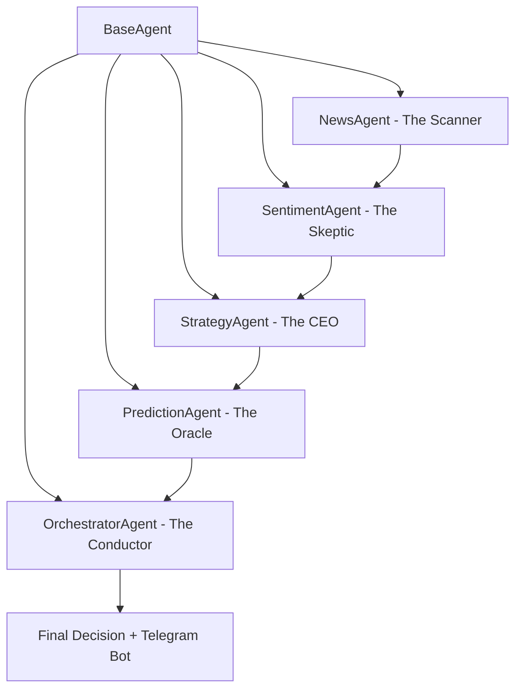

# 🌌 NVIDIA Informational Gravity Engine

**Advanced Multi-Agent AI System for Financial Market Prediction Using Informational Physics**

[](https://github.com/your-repo/nvidia-prediction)
[](https://python.org)
[](https://en.wikipedia.org/wiki/Multi-agent_system)
[](https://openai.com)
[](LICENSE)

---

## 🚀 Executive Summary

The **NVIDIA Informational Gravity Engine** represents the evolution from basic sentiment analysis to a sophisticated **Multi-Agent AI System** that treats financial markets as complex gravitational fields. Through revolutionary **Informational Gravity Theory**, **Non-Linear Physics-Based Technical Scoring**, and **Dynamic Strategy Adaptation**, this system achieves institutional-grade prediction accuracy by modeling news as physical forces that bend price trajectories through spacetime.

**Core Innovation**: Unlike traditional systems with static sentiment weights, our **StrategyAgent** dynamically adapts to market regimes—shifting from **80% Technical** during low-news periods to **80% Sentiment** during major catalysts like earnings releases.

---

## 🔬 The Theory: Informational Gravity

### Fundamental Concept

Markets don't simply move on news—they respond to **Gravitational Mass**. Our system revolutionizes financial prediction by treating information as physics:

- **High-Mass News** (Earnings, $10B+ deals, regulatory decisions) creates strong gravitational pull
- **Low-Mass Noise** (Speculation, opinions, general outlooks) has minimal gravitational effect
- **Price Movement** is the "Tail" responding to the informational "Head"

### The Physics of Information

$$\text{Gravitational Mass} = f(\text{Financial Concreteness}, \text{Source Authority}, \text{Market Relevance})$$

Where **Financial Concreteness** measures quantifiable data (revenue figures, deal values, specific metrics) versus vague speculation.

### Head & Tail Logic

| Component | Description | Mathematical Representation |
|-----------|-------------|----------------------------|
| **The Head** | Point of maximum probability concentration | $P(\text{price}) = \max(\sum F_{\text{gravity}})$ |
| **The Tail** | Distribution of uncertainty from conflicting signals | $\sigma = \sqrt{\sum (F_i - \bar{F})^2}$ |
| **Gravitational Force** | Combined effect of all informational mass | $F_{\text{total}} = \sum M_i \cdot D_i \cdot T_i$ |

---

## 🤖 Multi-Agent Architecture: "The Financial Brain"

Our system employs a **sophisticated multi-agent architecture** where specialized AI agents collaborate to analyze, strategize, and predict market movements.

### Core Agent Network



### Agent Specifications

#### 🧠 **BaseAgent** - The Foundation
The genetic blueprint providing core intelligence capabilities to all specialized agents.

#### 🔍 **NewsAgent (The Scanner)**
- **Deep-Text Scraping**: Full article content extraction using `newspaper3k` (primary) + `trafilatura` (fallback)
- **Content Limit**: Up to 10,000 characters per article
- **Smart Content Filtering**: NLTK stop-word removal before GPT analysis (30% content density increase)
- **Serper API Integration**: Real-time news search with relative date parsing
- **Dual Search**: Separate company (NVIDIA) and macro-economic news pipelines

#### 🔍 **SentimentAgent (The Skeptic)** - *Revolutionary Evolution*
- **Skeptical Financial Analyst** with advanced cognitive filters
- **Caps sentiment scores** at realistic ±100 range, preventing "Information Black Holes"
- **Graduated 5-Level Temporal Decay** for news aging (see below)
- **Smart Content Pipeline**: Stop-word filtered → 2,000 char optimized preview → GPT-4 analysis
- **GPT Temperature**: 0.45 (optimized for consistent, reproducible scoring)

#### 👔 **StrategyAgent (The CEO)** - *The System's Mastermind*
The crown jewel of our architecture:
- **Analyzes Market Regime** (Trending, Consolidating, Volatile, News-Heavy)
- **Sets Dynamic Weights** for Sentiment vs. Technical analysis
- **Applies Boundary Rules** to prevent extreme decisions
- **Provides Strategic Reasoning** for every weight adjustment
- **GPT Temperature**: 0.3 (conservative, strategy-focused)

#### 🎼 **OrchestratorAgent (The Conductor)**
Coordinates all agents and implements the **Hybrid Decision Engine** with real-time regime adaptation. Passes `technical_score`, `info_gravity`, and `strategy_weights` through the full pipeline.

#### 🔮 **PredictionAgent (The Oracle)**
- **ML-based prediction model** using scikit-learn
- **Opening Gap Prediction**: Separate model for next-day opening gap analysis
- **Gravity Accuracy Calibration**: Post-market feedback loop comparing predictions vs actual results

---

## ⚡ The Hybrid Decision Engine

### Core Formula

$$\boxed{\text{Final Gravity} = (\text{Info Gravity} \times W_s) + (\text{Technical Score} \times W_t)}$$

Where $W_s + W_t = 1.0$ and weights adapt dynamically based on market conditions.

### Dynamic Weighting System

| Rule | Trigger Condition | Weight Adjustment | Reasoning |
|------|------------------|------------------|-----------|
| **Noise Rule** | Low news volume (<2 articles) | Technical: **↑80%** | Market structure dominates when information is sparse |
| **High-Mass Rule** | Earnings, major catalysts | Sentiment: **↑80%** | Information gravity overwhelms technical patterns |
| **Technical Friction Rule** | Extreme RSI (>70 or <30) | Balanced: **60/40** | Overbought/oversold acts as friction against news |

---

## ⚛️ Non-Linear Physics-Based Technical Scoring Engine

### Architecture (v4.0)

Our technical scoring engine replaces simple linear addition with a **physics-inspired non-linear system**:

#### 1. Momentum × Volume Force (Non-Linear Interaction)
```
Volume acts as a FORCE MULTIPLIER on momentum (not additive).
vol_multiplier = √(volume_ratio)
momentum_force = base_momentum × vol_multiplier × 0.6
```
- Quadratic boost for breakouts (momentum > 4%)
- Volume amplifies or dampens the signal naturally

#### 2. RSI Smooth Exponential Penalty
```
Overbought penalty:  -(overshoot^1.8) / 200   (smooth, no hard thresholds)
Oversold bounce:     +(undershoot^1.8) / 200
NVIDIA-tuned:        75/25 thresholds (high-volatility stock)
```

#### 3. Bollinger Bands — Context-Aware (Volume Interaction)
| Condition | High Volume (>1.3×) | Low Volume |
|-----------|--------------------:|------------|
| **Above Upper Band** | ✅ Trend Continuation (Bullish) | ⚠️ Reversion Risk (Bearish) |
| **Below Lower Band** | 📉 Panic Selling (more downside) | 🔄 Bounce Candidate (Bullish) |
| **Inside Bands** | Mild mean reversion toward center | Mild mean reversion |

#### 4. Moving Average Convergence (Logarithmic Scaling)
$$\text{MA Score} = \text{sign}(d) \times \ln(1 + |d|) \times w$$
- Diminishing returns when overextended from MA
- Gravitational pull penalty for extreme extension (>8%)

#### 5. Tanh Normalization → [-10, +10]
$$\text{Final Score} = 10 \times \tanh(0.18 \times \text{Total Raw})$$
- Smooth saturation prevents extreme scores
- Scale factor k=0.18 optimized for NVIDIA's volatility profile

#### 6. ATR-Based Confidence Level (0-100%)
| ATR % | Base Confidence | Context |
|-------|---------------:|---------|
| > 4.0% | 30% | Extreme volatility |
| > 3.0% | 50% | High volatility |
| > 1.5% | 70% | Moderate volatility |
| < 1.5% | 80% | Low volatility |

**Squeeze Detection**: Low ATR + narrow Bollinger = breakout imminent → +15% confidence boost

---

## 🕐 Graduated 5-Level Temporal Decay System

News impact decays based on age relative to New York market hours:

| Level | Age Range | Decay Factor | Description |
|-------|-----------|:------------:|-------------|
| **Level 1** | 0-6 hours | **1.00** | Full impact (fresh news) |
| **Level 2** | 6-12 hours | **0.85** | Slight decay |
| **Level 3** | 12-24 hours | **0.65** | Moderate decay |
| **Level 4** | 24-48 hours | **0.35** | Heavy decay (weekend staleness) |
| **Level 5** | 48+ hours | **0.15** | Minimal residual impact |

Decay applies to both **sentiment score** and **gravitational mass**:
$$\text{Decayed Score} = \text{Original Score} \times F_{\text{decay}}(t)$$

---

## 📰 Smart Content Pipeline

### The Problem (Pre-v4.0)
Articles were scraped (up to 10,000 chars) and saved to database, but only **500 characters** were sent to GPT for analysis — essentially just the title and first two sentences.

### The Solution: Local Content Filtering
```
Raw Article (10,000 chars)
    ↓ NLTK Stop-Word Removal (FREE, ~30% reduction)
    ↓ "The company announced that it will be launching a new AI chip"
    ↓  →  "company announced launching new AI chip"
    ↓ Take first 2,000 chars of filtered text
    ↓ Equivalent to ~2,800 chars of original content
    ↓ Send to GPT-4 for sentiment analysis
```

**Result**: **4× more useful content** reaches GPT at the same token cost.

### Content Fallback Priority
```
full_content (scraped) → summary → snippet → content → title (NEVER NULL)
```

---

## 📊 Technical Indicators (Full Stack)

| Indicator | Type | Calculation | Role in Physics Engine |
|-----------|------|-------------|----------------------|
| **RSI(14)** | Momentum | $RSI = 100 - \frac{100}{1 + RS}$ | Smooth exponential penalty |
| **MACD(12,26,9)** | Trend | EMA crossover | Signal confirmation |
| **3-Day Momentum** | Short-term | $(C_t - C_{t-3})/C_{t-3} \times 100$ | Primary directional force |
| **MA-50 Distance** | Trend | $(P - MA_{50})/MA_{50} \times 100$ | Logarithmic convergence |
| **MA-200 Distance** | Long Trend | $(P - MA_{200})/MA_{200} \times 100$ | Lower weight convergence |
| **Bollinger Bands** | Volatility | 20-period, 2σ | Context-aware with volume |
| **Bollinger %B** | Position | $(P - \text{Lower})/(\text{Upper} - \text{Lower})$ | Breakout/reversion logic |
| **Bollinger Width** | Squeeze | $(\text{Upper} - \text{Lower})/\text{Middle} \times 100$ | Breakout detection |
| **ATR(14)** | Volatility | True Range average | Confidence metadata |
| **ATR %** | Normalized | $\text{ATR}/\text{Price} \times 100$ | Volatility regime |
| **Volume Ratio** | Conviction | $\text{Volume}/\text{20d Avg}$ | Force multiplier |

---

## 🔑 Trusted Source Tiering System

### Company News (NVIDIA-specific)
| Tier | Sources | Weight |
|------|---------|:------:|
| **Tier 1** | Bloomberg, Reuters, WSJ, CNBC, Financial Times | Highest |
| **Tier 2A** | Seeking Alpha, Barron's, Forbes, Business Insider, Motley Fool | High (Financial) |
| **Tier 2B** | TechCrunch, The Verge, Ars Technica, Tom's Hardware | High (Tech) |
| **Tier 3** | Yahoo Finance, MarketWatch, CNET | Standard |

### Macro-Economic News
| Tier | Sources | Weight |
|------|---------|:------:|
| **Tier 1** | Federal Reserve, BLS, Treasury, Bloomberg, Reuters | Highest |
| **Tier 2** | CNBC, FT, WSJ, The Economist | High |
| **Tier 3** | Yahoo Finance, MarketWatch, AP, BBC Business | Standard |

---

## 📐 Gravity Accuracy Calibration System

A sophisticated **post-market feedback loop** that measures prediction accuracy:

### Scoring Method
- **Opening Gap Prediction**: Compares predicted gap vs actual next-day opening gap
- **Gravity Grade**: Letter grades (A+ through F) based on accuracy percentage
- **Continuous Learning**: Results feed back into model confidence calibration

### Opening Gap Separation
The system separates two distinct movements:
- **Opening Gap %**: `(next_day_open - current_close) / current_close × 100`
- **Close-to-Close %**: `(next_day_close - current_close) / current_close × 100`

This separation allows independent analysis of overnight gap forces vs. intraday momentum.

---

## 🏗️ Project Architecture

```
📁 Project Root
├── 🤖 /agents/                 # Multi-Agent AI System
│   ├── base_agent.py           #   Core agent foundation
│   ├── sentiment_agent.py      #   Skeptical Analyst + Temporal Decay + Content Filter
│   ├── strategy_agent.py       #   Strategic CEO (Dynamic Weights)
│   ├── news_agent.py           #   News Scanner (Scraping + Search)
│   ├── orchestrator_agent.py   #   System Conductor (Hybrid Engine)
│   └── prediction_agent.py     #   Market Oracle (ML Predictions)
├── 📊 /data/                   # Data Management Layer
│   ├── database_manager.py     #   PostgreSQL operations + migrations
│   └── market_data_fetcher.py  #   Physics-Based Technical Engine
├── ⚙️ /config/                 # Configuration
│   ├── settings.py             #   Centralized settings (GPT temp, thresholds)
│   └── trusted_sources.py      #   4-tier source classification
├── 🎯 /views/                  # Professional Dashboards
│   ├── strategy_dashboard.py   #   StrategyAgent analytics
│   ├── sequential_analysis.py  #   Backtesting engine
│   ├── data_viewer.py          #   Data visualization
│   └── *_viewer.py             #   Specialized viewers
├── 📋 /database/               # Schema Management
│   ├── schema.sql              #   Normalized database design
│   └── setup.py                #   Automated DB setup
├── 🔧 /utils/                  # Supporting Infrastructure
│   ├── timezone_manager.py     #   NY timezone operations
│   ├── workflow_manager.py     #   Workflow orchestration
│   ├── analysis_utils.py       #   Analysis helpers
│   └── logger.py               #   Structured logging
├── 🧪 /tests/                  # Comprehensive Test Suite
├── 📚 /docs/                   # Technical Documentation
├── 📱 remote_controller.py     # Telegram Bot Controller
├── main.py                     # Production Entry Point
└── requirements.txt            # Dependencies
```

---

## 📱 Telegram Bot Integration

Remote monitoring and control via Telegram:

### Commands
| Command | Action |
|---------|--------|
| `/run` | Execute full daily workflow |
| `/status` | Check system status |
| `/predict` | Get latest prediction |

### Bot Display (v4.0)
The bot now shows enriched results including:
- 📊 **Technical Score** from the Physics Engine
- 📰 **Sentiment Score** (Info Gravity)
- ⚖️ **Strategy Weights** (Sentiment/Technical split)
- 📈 **Prediction Direction** with confidence
- 🎯 **Previous Accuracy** grades

---

## 🗃️ Database Schema (Normalized)

### daily_data Table
```sql
-- Stock Price Data
open_price, close_price, high_price, low_price, volume

-- Technical Indicators (8 new in v4.0)
rsi, macd, macd_signal, moving_avg_50, moving_avg_200,
bollinger_upper, bollinger_lower, bollinger_width, bollinger_pctb,  -- NEW
atr, atr_percent, volume_ratio,                                     -- NEW

-- Sentiment Analysis (separated by type)
sentiment_score, company_sentiment, macro_sentiment, sentiment_range,

-- Next Day Results (separated gaps)
next_day_close, next_day_open,
price_change_percent,    -- Close-to-close movement
opening_gap_percent,     -- Opening gap (separated in v4.0)

-- Gravity System
gravity_score, gravity_accuracy, gravity_grade,

-- ML Predictions
prediction, prediction_accuracy, opening_prediction,

-- Information Theory
entropy
```

### articles Table
```sql
url, source, title, summary,
full_content,            -- Complete scraped content (up to 10,000 chars)
article_type,            -- 'company' or 'macro'
sentiment_score,
gravitational_mass
```

---

## 🚀 Getting Started

### Prerequisites
- Python 3.8+
- PostgreSQL 12+
- OpenAI API Key (GPT-4)
- Serper API Key (news search)

### Installation

```bash
# 1. Clone and setup
git clone https://github.com/your-repo/nvidia-prediction-engine.git
cd nvidia-prediction-engine
python -m venv .venv
.venv\Scripts\activate  # Windows
source .venv/bin/activate  # Linux/Mac

# 2. Install dependencies
pip install -r requirements.txt

# 3. Download NLTK data (for content filtering)
python -c "import nltk; nltk.download('stopwords')"

# 4. Configure environment
# Create .env file with:
#   OPENAI_API_KEY=your_key
#   SERPER_API_KEY=your_key
#   DB_PASSWORD=your_password
#   DB_NAME=nvidia_prediction

# 5. Initialize database
python database/setup.py

# 6. Run the system
python main.py
```

### Execution Modes

```bash
# Full Daily Workflow (production)
python main.py

# Telegram Bot (remote control)
python remote_controller.py

# Strategy Dashboard
python views/strategy_dashboard.py

# Backtesting Engine
python views/sequential_analysis.py
```

---

## 📈 Key Configuration

| Setting | Value | Purpose |
|---------|-------|---------|
| `GPT_MODEL` | gpt-4 | Primary AI model |
| `GPT_TEMPERATURE` | 0.45 | Scoring consistency (lowered from 0.7) |
| `MAX_NEWS_ARTICLES` | 8 | Articles per analysis cycle |
| `STOCK_SYMBOL` | NVDA | Target stock |
| `TIMEZONE` | America/New_York | Market reference timezone |
| `RSI_PERIOD` | 14 | Standard RSI |
| `MA_SHORT / MA_LONG` | 50 / 200 | Moving averages |
| `SENTIMENT_SCALE` | (-100, +100) | Sentiment range |
| `MIN_TRAINING_DAYS` | 100 | ML model minimum data |

---

## 🔮 Future Roadmap

### Phase 1: Multi-Asset Expansion *(Q2 2026)*
- Extend beyond NVIDIA to SP500 coverage
- Cross-asset correlation analysis
- Sector-specific StrategyAgent variants

### Phase 2: Real-Time Execution *(Q3 2026)*
- Live trading integration
- Risk management overlay
- Portfolio optimization engine

### Phase 3: Deep Learning Evolution *(Q4 2026)*
- Neural network enhanced gravity calculations
- Transformer-based regime detection
- Reinforcement learning strategy optimization

---

## 📊 Version History

### v4.0.0 (March 2026) — Current
- ⚛️ Non-Linear Physics-Based Technical Scoring Engine
- 📰 Smart Content Filtering (NLTK stop-word removal + 2,000 char optimized preview)
- 🕐 Graduated 5-Level Temporal Decay System
- 📊 8 New Technical Indicators (Bollinger Bands, ATR, Volume Ratio)
- 📐 Opening Gap % Separation from close-to-close movement
- 🎯 Gravity Accuracy Calibration System
- 📱 Telegram Bot with Technical Score, Sentiment Score & Strategy Weights
- 🔧 GPT Temperature optimized to 0.45
- 🗃️ Full schema normalization and audit
- 🏷️ 4-tier trusted source classification system
- 🌐 NY Timezone strict enforcement across all operations

### v3.0.0 (February 2026)
- Multi-Agent Architecture (Sentiment, Strategy, Prediction, Orchestrator)
- Informational Gravity Theory implementation
- Dynamic Strategy Weights
- PostgreSQL database integration
- News scraping with newspaper3k + trafilatura

---

## 📜 License

MIT License - See [LICENSE](LICENSE) for details.

---

## 🤝 Contributing

We welcome contributions from quantitative researchers, AI engineers, and financial technologists. Please review our development principles:

- **Scientific Rigor**: All features must have theoretical foundation
- **Performance First**: Code optimized for institutional-grade execution
- **Comprehensive Testing**: Full test coverage for production reliability
- **Documentation Excellence**: Clear explanations for complex financial AI

---

> *"In the quantum realm of financial markets, information is not merely data—it is mass, energy, and gravitational force shaping the spacetime of price discovery."*
>
> **— The Informational Gravity Theory**
